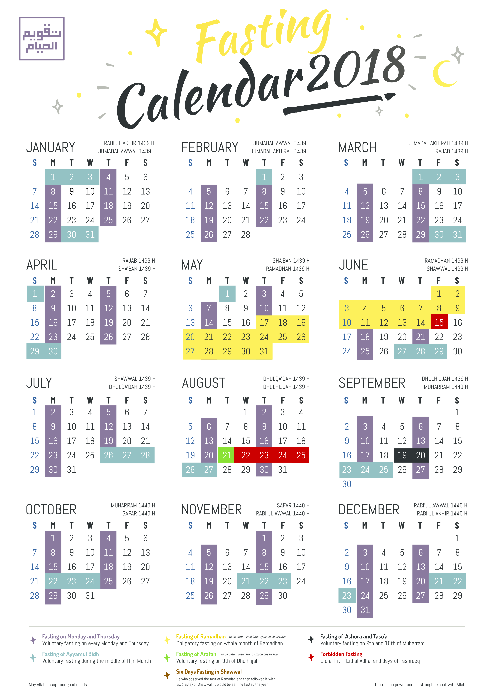

# Muslim Fasting Calendar 2018

The Prophet Muhammad , peace be upon him, said : 

> By Him in Whose Hands my soul is, the smell coming out from the mouth of fasting person is better in sight of Allah than the smell of musk. (allah says about the fasting person), "He has left his food, drink, and desires for My Sake. The fast is for Me. So I will reward (the fasting person) for it and the reward of good deeds is multiplied ten times."

^reference : Sahih al-Bukhari 1894^

So , I present to, especially myself, my brother, and sister as a reminder this Muslim Fasting Calendar 2018 which can be obtained in this repository or simply download at :

### English Version

PNG : [https://goo.gl/UZuKsW](https://goo.gl/UZuKsW)

PDF : [https://goo.gl/qbtQA6](https://goo.gl/qbtQA6)

### Bahasa Version 

PNG : [https://goo.gl/T7Nw6C](https://goo.gl/T7Nw6C)

PDF : [https://goo.gl/EDbgmk](https://goo.gl/EDbgmk)

May Allah grant us ease to do good deeds and accept our good deeds. There is no power and no strength except with Allah. Feel free to share to relatives and family.

Jazakumullahu khairan katsiran.

